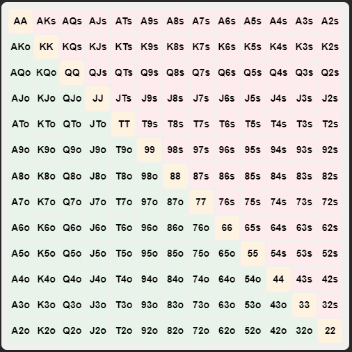

# Obsidian Poker Range

Easily create, view, and interact with poker hand ranges in your notes.

## Screenshot



## How to Install

In Obsidian go to `Settings > Third-party plugins > Community Plugins > Browse` and search for `Poker Range`.

### Manual installation

Unzip the [latest release](https://github.com/marplek/obsidian-poker-range/releases/latest) into your `<vault>/.obsidian/plugins/` folder.

## How to Configure

The plugin allows you to customize the default range for new grids. Go to `Settings -> Poker Range` to set your preferred default range.

## How to Use

### Creating a Poker Range Grid

1. Manually create a code block:

    Use the following code block structure:

```poker-range
<!-- grid-id: grid-[enter random alphanumeric string]-[enter random alphanumeric string] -->
AA,87o
```

Note: Replace `[enter random alphanumeric string]` with any random alphanumeric string of your choice. Ex:grid-1724057738028-fhfj9uk6k

2. Use the command palette:

    1. Press `Ctrl+P` (or `Cmd+P` on Mac) to open the command palette
    2. Type "Insert Poker Range Table" and select the command

    This will insert a new poker range grid at your cursor position.

Both methods will create an interactive poker range grid in your note.

### Interacting with the Grid

-   Click on cells in the grid to select or deselect hands
-   The plugin will automatically update the range information in your note
